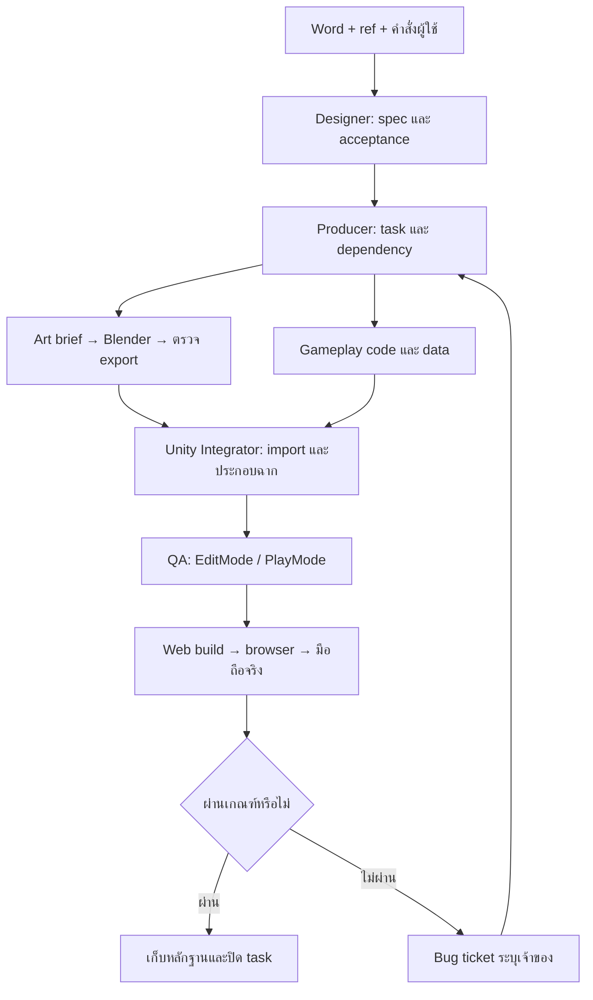

# ระบบ AI agent สำหรับผลิตเกม Hello Nakornpathom

สถานะ: แบบออกแบบระบบ ยังไม่ได้สร้างโมเดลหรือ gameplay ตามแผนนี้
ตรวจ workspace: 8 กันยายน 2026

## 1. เป้าหมายและข้อเท็จจริง

สร้างเกม Simulation ท่องเที่ยวนครปฐม บรรยากาศหวนคืนวันวาน เที่ยวงานองค์พระ เหมาะกับผู้เล่นอายุ 6 ปีขึ้นไป โดยเล่นผ่านเว็บเต็มพื้นที่หน้าจอมือถือแนวนอน และรองรับคอมพิวเตอร์เป็นช่องทางรอง

| รายการ | สิ่งที่ตรวจพบ |
|---|---|
| เอกสารต้นฉบับ | `Game-Hello Nakornpathom.docx` ชื่อเกมในเอกสารคือ Hello Nakornpathom |
| รูปอ้างอิง | มี `ref/` แต่ยังไม่มีไฟล์ ณ วันที่ตรวจ |
| ภาพใน Word | ภาพมุมสูงบริเวณองค์พระ 2 ภาพ โดยภาพหนึ่งมีเส้นพิกัด ใช้ประกอบผังพื้นที่ได้ แต่ไม่พอยืนยันรายละเอียดอาคาร/สถานี/ตัวละคร |
| Unity project | `hnp-game/` มี SampleScene และ asset จาก template |
| Editor | `6000.6.0f1` จาก `ProjectSettings/ProjectVersion.txt` |
| Package สำคัญ | URP `17.6.0`, Input System `1.20.0`, Test Framework `1.8.0`, AI Navigation `2.0.14` |
| Unity MCP | ผู้ใช้แจ้งว่าเปิด server แล้ว แต่เซสชันที่จัดทำเอกสารยังไม่มี Unity MCP tool ให้เรียก จึงยังไม่ได้ตรวจ connection |
| Blender | ยังไม่ยืนยันเวอร์ชันหรือ MCP; ไม่พบ executable ผ่าน `Get-Command blender` ซึ่งไม่ได้ยืนยันว่าเครื่องไม่ได้ติดตั้ง |

## 2. ข้อกำหนดเกมจากต้นฉบับ

| ID | ข้อกำหนด | ระบบ/หลักฐานที่จะใช้ตรวจรับ |
|---|---|---|
| G01 | รถไฟวิ่งเข้าสถานี จอด ผู้เล่นลุกจากที่นั่งและลงรถไฟ | Arrival sequence + movement; เล่น intro จนควบคุมตัวละครได้ |
| G02 | เดินจากสถานี ผ่านลานและสะพานยักษ์ไปองค์พระ มีเกมหลบรถข้ามถนน | Route + crossing minigame; ข้ามสำเร็จและ retry หลังชน |
| G03 | มีช่วงเดินก่อนเข้าองค์พระ เข้าไปไหว้พระและสวดตามให้ทัน | Exploration + prayer minigame; ผ่าน/พลาด/ลองใหม่ |
| G04 | เดินเล่นรอบบน และรอบล่างจำลองงานองค์พระ | Upper/lower zones; เดินต่อถึงกันและมีแผนที่แสดงตำแหน่ง |
| G05 | เกมปาลูกโป่งและโยนห่วง | Minigame contract; เริ่ม เล่น คิดคะแนน จ่ายเงิน และออกเกม |
| G06 | นั่งรถไฟกลับเพื่อจบเกม | Return route + ending; จบแล้วเริ่มใหม่ได้ |
| G07 | เดินสี่ทิศ กระโดด หมุนกล้อง ปรับระยะ และมุมมองที่ 1, 2 | Touch/desktop input + camera; ข้อความมุมมองที่ 2 ยังต้องตีความ |
| G08 | เก็บของ ซื้อของ ปรับแต่งตัวละคร | Inventory + wallet + wardrobe; ของ/เงินตรงหลังซื้อและโหลดเซฟ |
| G09 | ท่านั่ง เต้น นอน ดีใจ กระโดด; อ้างอิงการเคลื่อนไหวแบบ 12 หาง | Animation checklist; สร้างโมเดลและท่าของเกมเอง |
| G10 | เสื้อกระดุมสีไข่ กางเกงขาสั้นดำ รองเท้าแตะ หมวกคาวบอย | Default outfit; preview และ prefab ตรงรายการ |
| G11 | รองเท้า เสื้อ กางเกง หมวก แว่นตา ร่ม กระเป๋า | Item definitions; ต้นฉบับเขียนว่า 6 แต่แจกแจง 7 ประเภท |
| G12 | แพ้เมื่อเงินหมด | Wallet + game over; ตรวจยอดศูนย์และการเปลี่ยนสถานะ |
| G13 | กล่าวถึงลอยกระทง งานเต้น และอาวุธไม้ ปืน ท่อเหล็ก | บันทึกไว้ใน backlog; ยังไม่มีรายละเอียดกติกาหรือระบบต่อสู้ |
| P01 | เว็บเต็มจอ มือถือแนวนอน ตามคำสั่งผู้ใช้ | Web shell + touch UI; ทดสอบ browser จริง |

## 3. ข้อเสนอเริ่มต้นและเรื่องที่ยังไม่ชัด

ข้อเสนอต่อไปนี้ใช้ทำ prototype ได้โดยติดป้าย assumption และแก้ได้ภายหลัง ไม่ใช่ข้อความยืนยันจาก Word

- ภาพ 3D stylized low-poly โทนอุ่น เน้นเงารูปทรงองค์พระ ความคึกคักของงาน และพื้นที่อ่านง่ายบนจอเล็ก
- ใช้ third-person เป็นค่าเริ่มต้น และ first-person เป็นตัวเลือก; คำว่า “มุมมองที่ 2” ในต้นฉบับยังไม่ชัด ต้องสรุปก่อนเก็บงานกล้องขั้นสุดท้าย
- บีบระยะทางจริงให้เดินสนุก ใช้ตำแหน่ง landmark จาก ref เป็นหลัก ไม่อ้างว่าเป็นแผนที่สำรวจที่แม่นยำ
- สวดตามเป็นการแตะตามข้อความ/จังหวะ ไม่ต้องใช้ไมโครโฟน; เนื้อหาบทสวดจริงต้องตรวจให้ตรงก่อน final content
- เกมหลบรถชนแล้วกลับ checkpoint ไม่มีภาพบาดเจ็บ; ค่าเสียเงินจากการชนยังไม่กำหนด
- เงินเป็นเงินในเกม เริ่ม prototype ที่ 100 หน่วย ค่าเล่น 10 หน่วย และปรับได้ผ่าน data asset; ยังไม่มีระบบจ่ายเงินจริง
- เมื่อ transaction จบและยอดเหลือศูนย์ให้ GameOver ตามต้นฉบับ; การหักค่าเล่นจนเหลือศูนย์ต้องตรวจสถานะก่อนเปิด minigame เพื่อไม่ให้เกมสองสถานะทำงานพร้อมกัน
- ค่าเดินทางกลับตั้งต้นเป็นศูนย์; ending เกิดเมื่อทำกิจกรรมหลักครบและขึ้นรถไฟกลับขณะยังไม่ GameOver; จำนวนกิจกรรมบังคับเป็นข้อมูลปรับได้
- ใช้รายการแต่งตัว 7 ประเภทตามที่แจกแจง และบันทึกข้อขัดแย้งเรื่องจำนวนไว้
- ลอยกระทง งานเต้น และอาวุธเป็นงานหลัง core loop; ไม่อนุมานเพิ่มระบบต่อสู้จากรายการอาวุธเพียงอย่างเดียว
- Single-player, local save, ไม่มี backend ในระยะแรก ระยะเล่นตั้งต้นประมาณ 10–15 นาที ต้องปรับจาก playtest

บันทึกการเปลี่ยนข้อเสนอใน `docs/decisions/` เมื่อเริ่ม implementation โดยระบุเหตุผล ผลต่อ task และผู้ให้ข้อกำหนด ไม่จำเป็นต้องหยุดงานส่วนที่ไม่ขึ้นกับคำตอบ

## 4. บทบาทของ agent

| บทบาท | รับข้อมูล | หน้าที่และพื้นที่เขียน | ส่งมอบ / ผู้ตรวจ |
|---|---|---|---|
| Producer / Orchestrator | ข้อกำหนด, task status, test report | แตกงาน จัด dependency และสิทธิ์เขียน; `docs/tasks/`, `docs/decisions/` | Task packet, integration order / QA |
| Game Designer | Word, คำสั่งผู้ใช้ | กติกา flow เงิน difficulty และ acceptance; `docs/design/` | Feature spec ที่ trace กลับ G/P ID ได้ / Producer |
| Art & Reference Designer | `ref/`, feature spec | วิเคราะห์รูปทรง palette scale และ asset brief; `docs/art/` | Brief + reference mapping / Blender Artist |
| Blender Artist | Asset brief | สร้าง mesh, UV, material, rig, animation, export; `art-source/`, `art-export/` | `.blend`, FBX, texture, preview, manifest / Art review + Integrator |
| Unity Integrator | Export ที่ผ่านตรวจ | นำเข้า material rig collider prefab และจัดฉากผ่าน MCP; `Assets/_HNP/Art`, `Prefabs`, `Scenes` | Prefab/scene ที่ไม่มี reference หาย / QA |
| Gameplay Engineer | Feature spec, prefab contract | C#, data assets, UI, touch, save, minigame; `Assets/_HNP/Scripts`, `Data`, `UI` | เล่น feature ได้ + tests ที่เกี่ยวข้อง / QA |
| Web & Performance Engineer | Unity build, budget | Web template, fullscreen, orientation, build config และ profiling | Build + browser/performance report / QA |
| QA / Playtester | Acceptance, build ID | ทดสอบ correctness, ภาพ, browser, มือถือ และ regression; `reports/` | PASS/FAIL พร้อมหลักฐานและ bug ticket / Producer |

ชื่อบทบาทเป็นความรับผิดชอบ ไม่บังคับจำนวน process หากมี agent เดียวให้สลับหมวกและตรวจงานตามเกณฑ์เดียวกัน
เมื่ออนุญาตให้ทำงานขนาน งาน Blender ของคนละ asset และ C# คนละระบบทำพร้อมกันได้หลังตกลง interface; Unity Integrator เป็นผู้ถือสิทธิ์เขียน Editor เพียงรายเดียว QA ที่กด Play/เปลี่ยนฉากต้องรับสิทธิ์นี้ก่อน

## 5. วงจรงานและสัญญาส่งต่อ



สถานะ task: `BACKLOG → READY → IN_PROGRESS → REVIEW → VERIFIED → DONE`; ใช้ `BLOCKED` พร้อมเหตุผลและเงื่อนไขปลดล็อกได้จากทุกช่วง ห้าม DONE ถ้า acceptance ยัง NOT RUN

Task packet ที่สร้างเมื่อเริ่มงานแต่ละรายการ:

```yaml
id: HNP-ART-001
requirement_ids: [G01]
owner_role: Blender Artist
status: READY
goal: สร้างชานชาลา modular สำหรับฉากเริ่มเกม
inputs: [docs/art/station-brief.md]
depends_on: [HNP-002]
write_scope: [art-source/station/, art-export/station/]
outputs: [platform.blend, platform.fbx, platform-preview.png, manifest.json]
acceptance:
  - ขนาดและ pivot ตรง brief
  - export ไม่มี texture หาย และอยู่ใน budget
  - Unity ตรวจ scale collider และ material ผ่าน
evidence: []
blockers: []
next_action: สร้าง blockout
```

ทุก handoff ต้องมี task ID, revision/hash, input/output paths, assumptions, acceptance result และ known issues ส่วน manifest ของโมเดลเพิ่ม unit, dimensions, triangles, material count, texture sizes, rig/clip list, collision intent และ reference IDs
ผู้รับตรวจไฟล์ว่ามีอยู่จริงก่อนเปลี่ยนสถานะ ห้ามใช้ชื่อไฟล์ในตัวอย่างเป็นหลักฐานว่ามี asset แล้ว

## 6. เครื่องมือและ preflight

1. อ่านเวอร์ชัน Unity/package จากไฟล์จริงและตรวจ active project ว่าคือ `hnp-game/` ตรวจว่า Web Build Support ใช้งานได้
2. Discover Unity MCP capabilities ใน client ปัจจุบัน บันทึกชื่อ tool และ transport ที่พบจริงใน `reports/environment.md`
3. เรียก read-only health/editor/project/scene inspection ที่ server รองรับ ตรวจ console และ dirty state ก่อน mutation
4. ถ้าไม่มี connector ให้รายงานว่าฝั่ง client ยังเข้าถึงไม่ได้ ขอเฉพาะข้อมูลการเชื่อมต่อที่ขาดเมื่อจำเป็น ระหว่างนั้นทำ spec, Blender source หรือ C# ที่ไม่ต้องพึ่ง Editor ต่อได้
5. ตรวจตำแหน่ง Blender และ `--version`; ถ้ามี Blender MCP ให้ discover เช่นเดียวกัน หากไม่มีใช้ Blender Python ผ่าน CLI ที่ติดตั้งจริงได้
6. ทำ asset smoke test: cube ขนาด 1 เมตร + directional marker → export → Unity → ตรวจแกน ขนาด material; ถ้ามี rig ให้ทดสอบคลิปสั้นด้วย
7. ทำ Web smoke build ให้เล่นบน Android Chrome และ iPhone Safari ตั้งแต่ต้น ก่อนสร้างฉากละเอียด

ใช้ command line/Editor automation เป็น fallback ได้ตามความสามารถที่มี แต่ห้ามเปิด Unity batch process อีกตัวกับ project ที่ Editor กำลังถืออยู่ หากต้องใช้ batch ให้ใช้ checkout แยกหรือปิด Editor อย่างถูกต้อง
หลัง script reload/MCP หลุด ให้ reconnect และอ่านสถานะก่อน retry เพื่อไม่สร้าง object ซ้ำ ทุกคำสั่งสร้าง scene/prefab ควรค้นหาจาก stable ID/path ก่อนสร้าง

## 7. โครงสร้างไฟล์ที่เสนอ

รายการนอกเหนือจากไฟล์เดิมและ `.md` ชุดนี้จะสร้างตาม task เมื่อเริ่มผลิตจริง

```text
HelloNakornpathom/
├── AGENTS.md
├── GAME_AGENT_SYSTEM.md
├── GAME_PRODUCTION_PLAN.md
├── Game-Hello Nakornpathom.docx
├── ref/                         # ภาพต้นฉบับ + index ระบุ source/สิ่งที่ใช้อ้างอิง
│   ├── locations/
│   ├── characters/
│   └── mood/
├── art-source/                  # .blend, Blender Python, texture source
├── art-export/                  # staging FBX/PNG + manifest ก่อนเข้า Unity
├── docs/
│   ├── design/
│   ├── art/
│   ├── tasks/
│   └── decisions/
├── reports/                     # environment, tests, screenshots, performance
├── builds/web/                  # output build; ไม่ใช่ source asset
└── hnp-game/
    ├── Assets/
    │   ├── _HNP/
    │   │   ├── Art/              # Models, Materials, Textures, Animations
    │   │   ├── Audio/
    │   │   ├── Data/
    │   │   ├── Prefabs/
    │   │   ├── Scenes/
    │   │   ├── Scripts/          # Core, Player, World, Economy, Minigames, Save
    │   │   ├── UI/
    │   │   └── Tests/            # EditMode, PlayMode
    │   ├── Plugins/WebGL/        # JS bridge ถ้าจำเป็น
    │   └── WebGLTemplates/HNP/
    ├── Packages/
    └── ProjectSettings/
```

## 8. สถาปัตยกรรมเกม

- `GameFlowController`: Boot → Menu → Arrival → Explore → Return → Ending และ GameOver; Minigame เป็น sub-state ของ Explore; Pause/RotateOverlay บังและพัก state ปัจจุบันได้
- `SceneFlowService`: Bootstrap เก็บ service ส่วนกลาง; โหลด Station, Route, Temple, Festival ทีละโซนเมื่อจำเป็น พร้อม spawn point และ loading state ห้ามสร้าง service ซ้ำตอนกลับโซน
- `InputRouter`: action เดียวกันรับ touch และ keyboard/mouse แยก Exploration/UI/Minigame action map และยกเลิก input ค้างเมื่อ pause/เสีย focus
- `PlayerController` + `CameraController`: movement, jump, camera orbit/zoom และ interaction; collider ของกล้องกันทะลุอาคาร
- `QuestProgress`: stable objective IDs เก็บลำดับสถานี → ข้ามถนน → ไหว้พระ → กิจกรรม → กลับ; map ใช้ข้อมูลตำแหน่งเดียวกับ navigation marker
- `WalletService`: transaction atomic, ป้องกัน double tap, ยอดไม่ติดลบ, emit GameOver ครั้งเดียว; UI อ่านยอดจาก service เดียว
- `InventoryService` / `Wardrobe`: item IDs และ slot definitions แยกจาก prefab; ซื้อแล้วต้องได้ของครั้งเดียว
- `MinigameCoordinator`: สัญญากลาง `CanEnter → charge → Enter → Begin → Complete/Cancel → restore player`; คืน input/camera แม้ยกเลิกหรือ scene unload
- `SaveService`: schema version, checkpoint, money, items, outfit, objective state; save หลัง transaction/จบกิจกรรม ไม่พึ่งการปิดแท็บอย่างเดียว; storage ใช้ไม่ได้ให้แจ้งและเล่นแบบไม่บันทึกได้
- ScriptableObject ใช้เก็บ configuration เช่นราคา/คะแนน/เวลาที่ปรับได้; runtime state แยกจาก asset ต้นแบบ; ส่งผลมินิเกมเป็น result ที่มี ID ป้องกันรับรางวัลซ้ำ

ไม่บังคับเพิ่ม networking, Addressables หรือ framework ใหม่จนมีความจำเป็นจริง เริ่มจากโซนเล็กและข้อมูลที่ทดสอบได้
