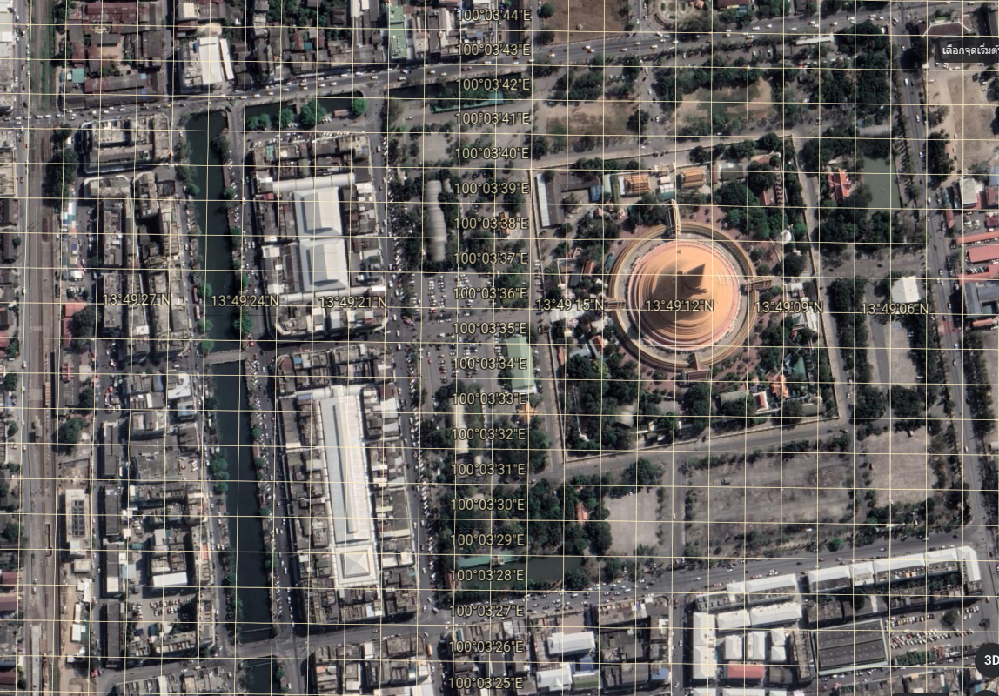
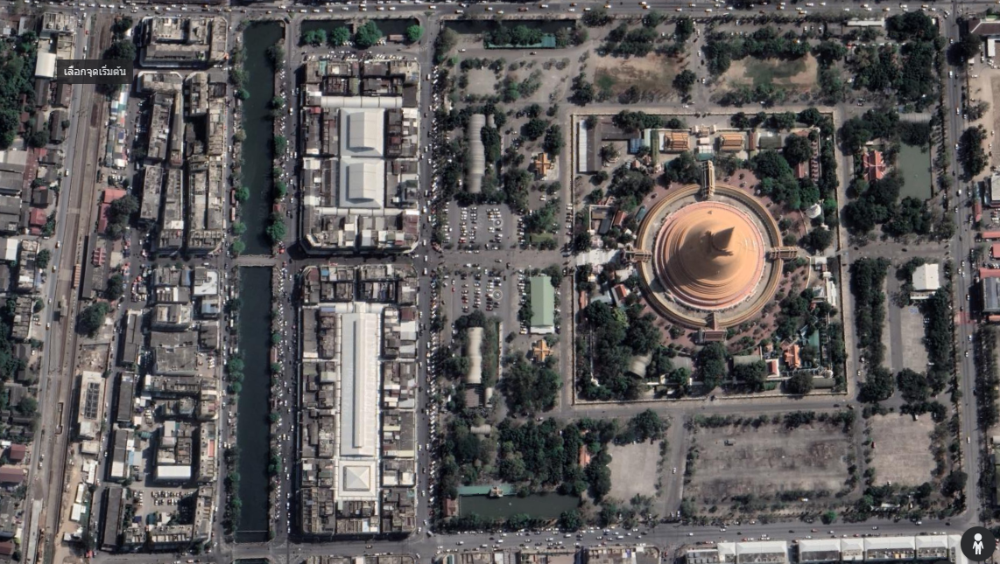

# GameDesign: Hello Nakornpathom

> ถอดข้อความและภาพจาก `Game-Hello Nakornpathom.docx` ตามลำดับในเอกสาร ไม่แก้คำสะกดหรือข้อขัดแย้งของต้นฉบับ

> คำอธิบายตำแหน่งสถานีและเส้นทางที่ผู้ใช้เพิ่มเติมแยกไว้ใน [ข้อกำหนดแผนที่](docs/design/MAP_LAYOUT.md)

## เนื้อหาต้นฉบับ

Hello Nakornpathom

GameDesign : Hello Nakornpathom

High concept statement: หวนคืนวันวานที่แสนคิดถึงในเมืองนครปฐม

Genre: Simulation Games

Story:

1\. นั่งรถไฟมาลงที่สถานีรถไฟนครปฐม

2\. เดินผ่านลานข้ามสะพานยักษ์มาที่องค์พระ

3\. เดินเข้าองค์พระไปไหว้พระ

4\. เดินรอบบนชิวๆ

5\. เดินรอบล่างเล่นเกมต่างๆ จำลองงานองค์พระ

6\. นั่งรถไฟกลับจบเกม

Audience: เด็กอายุ 6 ขึ้นไป (เล่นคอมได้)

Player roles: ผู้เล่นเป็นนักท่องเที่ยว นักรถไฟมาเที่ยวงานองค์พระ

Challenges:  จะใช้ฉากเป็นสถานที่จริงในจังหวัดนครปฐม จำลองการท่องเที่ยวในช่วงเทศกาลงานองค์พระ ลอยกระทง งานเต้น

1\. ฉากสถานีรถไฟ เป็นฉากเปิดเข้าเกมคือถไฟวิ่งมาที่สถานีแล้วจอด เราที่นั่งอยู่ก็เดินลงมาจากรถไฟ

2\. ฉากสะพานระหว่างเดินไปองค์พระ เป็นเกมวิ่งหลบรถข้ามถนน

3\. มีด่านเดินก่อนแปปนึง

4.ฉากเข้าองค์พระไหว้พระ สวดตามให้ทัน

5\. ฉากเล่นเกมตามมรอบองค์พระ เกมปาลูกโป่ง เกมโยนห่วง

Actions: ในเกมนี้จะมี Actions ดังนี้

ปุ่มเดินซ้าย ขวา หน้า หลัง

ปุ่มกระโดด

ปรับทิศทางมุมกล้อง หมุน ปรับระยะ มุมมองที่ 1, 2

เก็บของ

ซื้อของ

Character Design:

8.1 Character detail: เป็นตัวละครที่ปรับแต่งได้

8.2 Poses: มีท่านั่ง เต้น นอน ดีใจ กระโดด เลียนแบบ 12 หาง

8.3 Cloth: เสื้อกระดุมสีไข่ กางเกงขาสั้นสีดำ รองเท้าแตะ หมวกทรงคาวบอย

8.4 Weapon: ไม้ ปืน ท่อเหล็ก

Storyboard

9.1 progress:

มีแมพให้ดูว่าอยู่ตรงไหน

9.2 Item:

ไอเทมในเกมนี้มีทั้งหมด 6 อย่างดังนี้

9.2.3 รองเท้า

9.2.4 เสื้อ

9.2.5 กางเกง

9.2.6 หมวก

9.2.7 แว่นตา

9.2.8 ร่ม

9.2.9 กระเป๋า

9.3 Victory and lose condition:

แพ้เมื่อตังหมด
