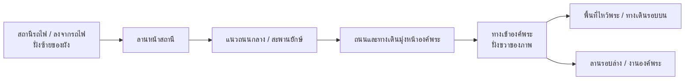

# แผนผังสถานีรถไฟ → องค์พระ

## แหล่งข้อมูลและขอบเขต

- [รายละเอียดเกมจาก Word](../../Game-Hello%20Nakornpathom.md)
- [MAP-01: ภาพมีเส้นพิกัด](../../ref/game-document/image1.png)
- [MAP-02: ภาพมุมสูงสำหรับวางผัง](../../ref/game-document/image2.png)
- คำอธิบายล่าสุดจากผู้ใช้: “รถไฟคือสถานีที่อยู่ด้านซ้าย หน้าถนนกลาง ตรงไปองค์พระ”

สร้างฉาก `NakornpathomWorld.unity` ตามตำแหน่งสัมพันธ์นี้แล้ว ดูภาพและผลตรวจใน `reports/world/` ระยะถูกย่อสำหรับการเดินสำรวจ ไม่ใช่แผนที่สำรวจจริง

## ผังที่ต้องยึด

สถานีรถไฟอยู่ด้านซ้ายของผังตามคำอธิบายผู้ใช้ ออกจากสถานีมาที่แนวถนนกลาง แล้วเดินตรงตามแนวเส้นทางไปองค์พระด้านขวาของภาพ ให้แนวถนนเชื่อมพื้นที่สถานีกับองค์พระเป็นแกนหลักของแมพ
คำว่า “ซ้าย/ขวา” ในที่นี้อ้างอิงภาพ ไม่ใช่การยืนยันทิศเหนือ/ใต้ทางภูมิศาสตร์

ไดอะแกรมแสดงลำดับการเดิน ไม่ใช่ระยะจริง ตำแหน่งสะพานและจุดข้ามถนนให้เทียบ MAP-02 ตอนทำ blockout โดยรักษาแนวทางหลักจากซ้ายไปองค์พระ

## สิ่งที่เห็นในรูปและสิ่งที่ผู้ใช้ระบุ

| องค์ประกอบ | ฐานข้อมูล | แนวทางสร้าง |
|---|---|---|
| องค์พระและฐาน/พื้นที่ล้อมรอบ | เห็นชัดในภาพฝั่งขวา | เป็น landmark หลัก ต้องเห็นจากเส้นทางเข้าสู่พื้นที่ |
| แนวคลองและสะพาน | เห็นในภาพฝั่งซ้ายถึงกลาง | วางเป็นส่วนของเส้นทางเชื่อม ไม่ละคลองทิ้งจนลำดับพื้นที่เปลี่ยน |
| ถนนแนวเชื่อมไปองค์พระ | ภาพมุมสูงและคำอธิบายผู้ใช้ | รักษาทางเชื่อมและแนวสายตาไปองค์พระ |
| สถานีรถไฟฝั่งซ้าย | ผู้ใช้ยืนยันตำแหน่งสัมพันธ์ | วางจุดเริ่มฝั่งซ้าย; ภาพนี้ยังไม่ยืนยันขอบอาคารสถานีหรือรางแต่ละเส้นอย่างละเอียด |
| สะพานยักษ์และกิจกรรมข้ามถนน | เนื้อหา Word | ทำจุดเชื่อมที่เดินผ่านได้และจุดหลบรถบนเส้นทาง ไม่ตั้งชื่อสะพานจากภาพเพียงอย่างเดียว |
| ร้านงานวัด/จุดไหว้พระ | Word; รูปมุมสูงไม่เห็นรายละเอียดกิจกรรม | ใช้ blockout ก่อน เพิ่มร้านและกิจกรรมภายหลัง |

อย่าเลือกอาคารยาวริมคลองเป็นสถานีโดยอัตโนมัติ ให้แยก “ตำแหน่งเริ่มฝั่งซ้ายตามผู้ใช้” ออกจาก “ขอบเขตอาคารที่ยืนยันแล้ว”

## ข้อกำหนดสำหรับ Unity blockout ถัดไป

1. ใช้ MAP-02 เป็นภาพหลักสำหรับตรวจตำแหน่งสัมพันธ์ของสถานี ถนน คลอง สะพาน และองค์พระ
2. ตั้งต้นด้วยแกน Unity `+X` ไปทางขวาของภาพ, `+Z` ไปทางบนของภาพ และ `+Y` เป็นความสูง นี่เป็น convention สำหรับทำงาน ไม่ใช่พิกัดภูมิศาสตร์จริง
3. แยก root เป็น `Station`, `StationForecourt`, `Canal`, `Bridge`, `MainRoad`, `TempleGrounds`, `FestivalGrounds` เพื่อแก้สเกลและรายละเอียดแต่ละพื้นที่ได้
4. ผู้เล่นเริ่มที่สถานีด้านซ้าย มอง/เดินออกสู่ถนนกลาง แล้วไปถึงองค์พระตามเส้นทางเดียวกันโดยไม่ teleport ข้ามช่วงสำคัญ
5. องค์พระต้องเป็นจุดหมายที่มองเห็นได้จากแนวถนนหลัก ก่อนถึงทางเข้า; จัดอาคารและต้นไม้ไม่ให้บังแนวสายตานี้ทั้งหมด
6. รักษาโครงสร้างพื้นที่จริงจากภาพก่อนลดระยะทางเพื่อความสนุก ขนาดเป็นเมตรและอัตราส่วนระยะทางยังเป็น `provisional` จนมีข้อมูลวัด ไม่ตีความเส้นพิกัดในภาพเป็นระยะที่วัดแล้ว
7. ฉากสถานีต้นแบบปัจจุบันใช้ทดสอบระบบควบคุมและโมเดลเท่านั้น เมื่อขยายแมพให้ยึดผังนี้เป็นฐาน และปรับทิศวางสถานี/ถนนตามภาพ

## เกณฑ์ตรวจรับแมพ

- ภาพ top-down จาก Unity เทียบกับ MAP-02 แล้วลำดับสถานีฝั่งซ้าย → ถนนกลาง/สะพาน → องค์พระฝั่งขวาตรงกัน
- เดินจากรถไฟผ่านลาน สะพาน/ถนน ไปถึงประตูองค์พระได้จริง ไม่มีช่องพื้นหรือ collider ขวางโดยไม่ตั้งใจ
- แนวกล้องผู้เล่นบนถนนกลางเห็นองค์พระเป็นจุดหมายได้
- มีทั้งทางขึ้น/พื้นที่รอบบนและพื้นที่รอบล่างสำหรับกิจกรรมตาม Word เมื่อพัฒนาถึงช่วงนั้น
- แยกผล “ตรงตำแหน่งสัมพันธ์” ออกจาก “ตรงขนาดจริง”; ห้ามรายงานว่าแม่นยำระดับแผนที่สำรวจจากภาพนี้อย่างเดียว

## ภาพหลัก

## ฉากที่สร้างแล้ว — HNP-WORLD-001

สถานีเริ่มที่ X=-101 คลอง X=-67 ถนนหลัก Z=0 และองค์พระ X=53 มีสะพานรอบนอกที่ Z=±58 และลานงานวัดด้านล่างของภาพ โมเดลรวมตามวัสดุเพื่อลด renderer จึงไม่ได้แยก root ตามข้อเสนอ blockout เดิมทุกชิ้น แก้พื้นที่จาก Blender source แล้วส่งออกใหม่

ผ่านการเดินต่อเนื่องจากสถานีขึ้นบันได วนลานองค์พระครบวง และกลับผ่านสะพานรอบนอก ดู [ผลตรวจ](../../reports/world/validation.md)
